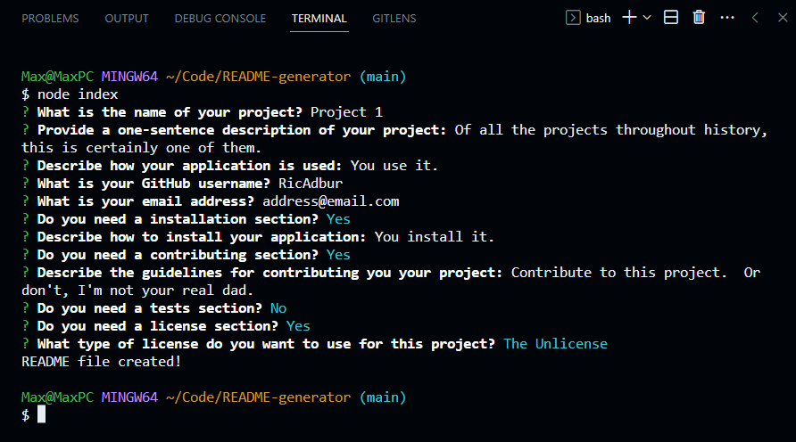

# README Generator
This is a simple command line application that helps the user generate README files for GitHub repos.  It prompts the user to answer some questions about their project and then generates a README.md file based on their responses.

## Installation
Clone the repo to your computer, open your terminal in the root directory of the application, and run `npm i` to download the necessary node packages.

---

[`Video`](https://drive.google.com/file/d/1tm7gl-JRb0T-c31rxGmce9KYsxT90EVS/view)
---

Powered by [node.js](https://nodejs.org/en) and [Inquirer](https://www.npmjs.com/package/inquirer)